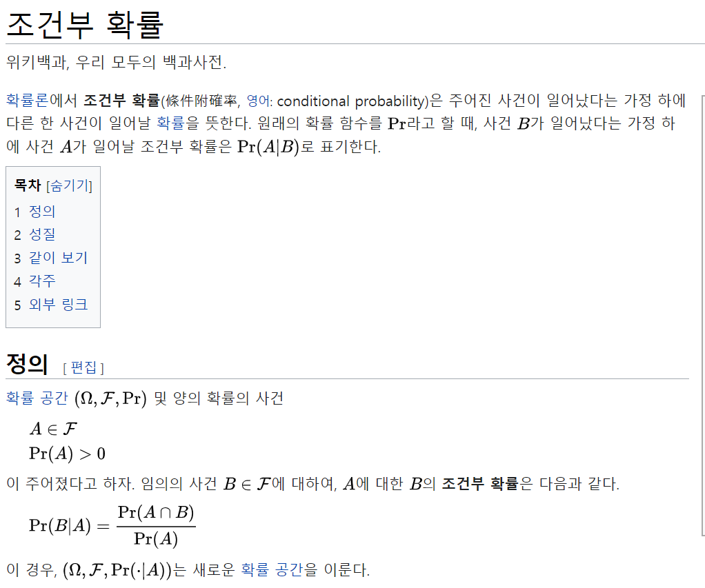

# 행렬, 확률, 통계

## 벡터

- 벡터로만 작업하는 경우 float 으로 이루어진 슬라이스에 빠르고 가벼운 연산이 필요하기 때문에 floats 가 좋은 선택이다
- 행렬과 벡터 모두 사용해야하는 경우 벡터/행렬 에 대한 좀 더 넓은 범위의 기능에 접근해야 하기 때문에 mat 을 사용하는 것이 더 나은 선택이다

```go
func main() {
var myVector []float64

myVector = append(myVector, 11.0)
myVector = append(myVector, 5.2)

fmt.Println(myVector)

vectorA := []float64{11.0, 5.2, -1.3}
vectorB := []float64{-7.2, 4.2, 5.1}

dotProduct := floats.Dot(vectorA, vectorB)
fmt.Printf("백터 내적: %0.2f\n", dotProduct)

floats.Scale(1.5, vectorA)
fmt.Printf("A에 1.5 곱셈: %v\n", vectorA)

normB := floats.Norm(vectorB, 2)
fmt.Printf("벡터 B의 놈/길이: %0.2f\n", normB)

vectorC := mat.NewVecDense(3, []float64{11.0, 5.2, -1.3})
vectorD := mat.NewVecDense(3, []float64{-7.2, 4.2, 5.1})

dotProduct = mat.Dot(vectorC, vectorD)
fmt.Printf("백터 내적: %0.2f\n", dotProduct)

vectorC.ScaleVec(1.5, vectorC)
fmt.Printf("C에 1.5 곱셈: %v\n", vectorC)

normD := blas64.Nrm2(vectorD.RawVector())
fmt.Printf("벡터 B의 놈/길이: %0.2f\n", normD)
}
```

## 행렬

```go
func main() {
data := []float64{1.2, -5.7, -2.4, 7.3}
a := mat.NewDense(2, 2, data)

fa := mat.Formatted(a, mat.Prefix(" "))
fmt.Printf("A = %v\n\n", fa)

val := a.At(0, 1)
fmt.Printf("val = %v\n\n", val)
col := mat.Col(nil, 0, a)
fmt.Printf("col = %v\n\n", col)
row := mat.Row(nil, 0, a)
fmt.Printf("row = %v\n\n", row)

a.Set(0, 1, 11.2)
a.SetRow(0, []float64{14.3, -4.2})
a.SetCol(0, []float64{1.7, -0.3})

fmt.Printf("A = %v\n\n", fa)

// 연산
a = mat.NewDense(3, 3, []float64{1, 2, 3, 0, 4, 5, 0, 0, 6})
b := mat.NewDense(3, 3, []float64{8, 9, 10, 1, 4, 2, 9, 0, 2})

c := mat.NewDense(3, 2, []float64{3, 2, 1, 4, 0, 8})

d := mat.NewDense(3, 3, nil)
d.Add(a, b)
fd := mat.Formatted(d, mat.Prefix(" "))
fmt.Printf("d = a + b = %0.4v\n\n", fd)

f := mat.NewDense(3, 2, nil)
f.Mul(a, c)
ff := mat.Formatted(f, mat.Prefix(" "))
fmt.Printf("f = a * c = %0.4v\n\n", ff)

g := mat.NewDense(3, 3, nil)
g.Pow(a, 5)
fg := mat.Formatted(g, mat.Prefix(" "))
fmt.Printf("g = a^5 = %0.4v\n\n", fg)

h := mat.NewDense(3, 3, nil)
sqrt := func (_, _ int, v float64) float64 { return math.Sqrt(v) }
h.Apply(sqrt, a)
fh := mat.Formatted(h, mat.Prefix(" "))
fmt.Printf("h = sqrt(a) = %0.4v\n\n", fh)

// 전치 행렬
ft := mat.Formatted(a.T(), mat.Prefix(" "))
fmt.Printf("a^T = %0.4v\n\n", ft)

// ad-bc
deta := mat.Det(a)
fmt.Printf("det(a) = %0.2v\n\n", deta)

// 역행렬
aInverse := mat.NewDense(3, 3, nil)
if err := aInverse.Inverse(a); err != nil {
log.Fatal(err)
}
fi := mat.Formatted(aInverse, mat.Prefix(" "))
fmt.Printf("a^-1 = %0.2v\n\n", fi)
}
```


## 통계

### 분포에 대한 통계적 측정 방법

- 중심 경향 측정 
  - 이 측정 방법은 값들이 가장 많이 존재하는 위치가 어디인지 그리고 분포 중심이 어디인지 측정한다

- 확산 또는 분산 측정

  - 분포된 값들이 전체 범위에 걸쳐 어떻게 분포돼 있는지를 측정한다 

    

### 중심 경향 측정 방법

- 평균 : 분포의 모든 수를 더하고 이를 더한 수의 개수로 나눈다

- 중앙값 : 분포에서 가장 작은 수에서부터 가장 높은 수에 이르기까지 모든 수들을 정렬한다면 중앙값은 가장 작은 수와 가장 높은 수의 절반을 의미한다

- 최빈값 : 가장 자주 발생하는 값을 의미한다


### 확산 또는 분산 측정하기

- 최댓값: 분포에서 가장 높은 값
- 최솟값: 분포에서 가장 낮은 값
- 범위 : 최댓값과 최솟값 사이의 차이
- 분산: 분포된 모든 값을 취한 다음 분포의 중앙값과의 차이를 구하고 이 차이 값을 제곱한다. 이어서 각 차이 값을 제곱한 수를 모두 더하고 분포의 값의 개수를 나눈다
- 표준 편차: 분산의 제곱근
- 분위수/사분위수: 중앙값과 유사하게 이 측정값은 특정 수의 값이 측정값 아래에 있는 위치와 특정 수의 값이 측정값 위에 있는 위치를 확인해 분포의 중단점을 정의한다 

### 분포 시각화하기

- 히스토그램 : 값을 구성하고 값의 개수를 세는데 활용할 수 있는 방법
- 박스 도표 
  - 분포에서 값의 그룹화 및 확산에 대한 이해도를 제공한다
  - 박스 도표 경계선은 중앙값, 1분위, 3분위로 정의 되어 분포의 기울기 정도를 알려준다

## 확률

### 확률 변수

[확률 공간](https://ko.wikipedia.org/wiki/확률_공간)에서 다른 [가측 공간](https://ko.wikipedia.org/wiki/가측_공간)으로 가는 [가측 함수](https://ko.wikipedia.org/wiki/가측_함수)이다.[[1\]](https://ko.wikipedia.org/wiki/확률_변수#cite_note-UCSB-1) 시행의 결과에 따라 값이 결정되는 변수를 나타낸다.[[2\]](https://ko.wikipedia.org/wiki/확률_변수#cite_note-2) 가측 함수 조건은 확률 변수가 [공역](https://ko.wikipedia.org/wiki/공역_(수학))이 되는 가측 공간 위에 새로운 [확률 측도](https://ko.wikipedia.org/wiki/확률_측도)를 유도할 수 있도록 하기 위해 필요하다. 이 확률 측도는 흔히 [확률 분포](https://ko.wikipedia.org/wiki/확률_분포)라고 부른다. (위키피디아)

### 확률 측정방법

확률은 0 ~ 1 사이의 수 또는 0%와 100% 사이의 수로 표현될 수 있다 

### 독립 및 조건부 확률

사건 중 하나의 확률이 다른 사건의 확률에 아무런 영향을 미치지 않는 경우 두 사건은 독립적이다 

- 독립 사건: 동전 던지기, 주사위 던지기
- 종속 사건: 카드 한 벌에서 교체 없이 카드를 꺼내는 경우 

#### [조건부 확률](https://ko.wikipedia.org/wiki/%EC%A1%B0%EA%B1%B4%EB%B6%80_%ED%99%95%EB%A5%A0)




### 위키백과 

- [카이 제곱](https://ko.wikipedia.org/wiki/%EC%B9%B4%EC%9D%B4%EC%A0%9C%EA%B3%B1_%EA%B2%80%EC%A0%95)

- [유의 확률 p-value](https://ko.wikipedia.org/wiki/%EC%9C%A0%EC%9D%98_%ED%99%95%EB%A5%A0)
